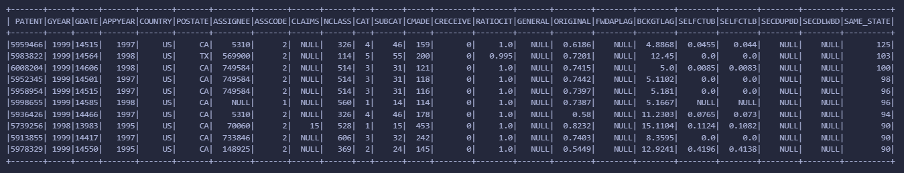
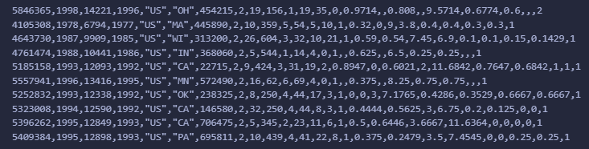

# Lab 4 – Patent Join: Solution Approach

This write-up explains how I solved the **same-state patent citations** problem in both the DataFrame and RDD notebooks.

---

## What We Had to Do

We have two datasets: one that says which patent cites which (CITING → CITED), and one with patent info including US state (`POSTATE`). The goal was to:

1. For each patent, count how many of the patents it *cites* are from the **same US state** as itself.
2. Add that count as a new column (`SAME_STATE`) to the patent data.
3. Report the **top 10 patents** with the most same-state citations.

We only count citations where both the citing and cited patent have a US state (non-null and non-empty). If a cited patent is from another country or has no state, that citation doesn’t contribute to the count.

---

## DataFrame Approach

I used the DataFrame API because it’s faster and easier to reason about joins. Here’s the flow I followed.

**Step 1 – Restrict to US patents with a state.**  
I filtered the patents table to `COUNTRY == "US"` and `POSTATE` not null and not empty. Only these rows can be part of a “same-state” pair, so I worked from this subset for the state lookups.

**Step 2 – Build state lookups for citing and cited.**  
From that filtered table I created two small DataFrames: one that maps patent ID to state for the *citing* side (columns `CITING`, `Citing_State`), and one for the *cited* side (`CITED`, `Cited_State`). That way I could attach both states to each citation.

**Step 3 – Join citations with both states.**  
I inner-joined the citations table with the citing-state table on `CITING`, then with the cited-state table on `CITED`. After that, every citation row had both `Citing_State` and `Cited_State`. Citations where either side didn’t have a US state dropped out, which is what we want.

**Step 4 – Same-state filter and count.**  
I kept only rows where `Citing_State == Cited_State`, then did a `groupBy("CITING")` and counted rows. That gave me, for each citing patent, how many of its citations were same-state.

**Step 5 – Attach the count to the full patents table and get top 10.**  
I left-joined the *full* patents table with this count table on `PATENT == CITING`, so every patent gets a row. I used `coalesce(..., 0)` so patents with no same-state citations get 0 instead of null. Then I added a `SAME_STATE` column, sorted by it descending, and took the first 10 rows.

**What I got:** A 10-row table with all the original patent columns plus `SAME_STATE`, sorted so the patent with the most same-state citations is first.

### Output

---

## RDD Approach

For the RDD version I did the same logic, but with key–value pairs and joins instead of DataFrames.

**Step 1 – Parse citations.**  
I skipped the header (the line with `"CITING"`) and for each data line split by comma and turned the two fields into integers. So I had an RDD of `(citing, cited)` pairs.

**Step 2 – Parse patents and build two RDDs.**  
Again I skipped the header and used CSV parsing to get `PATENT`, `COUNTRY`, and `POSTATE`. I built: (1) an RDD of `(patent_id, state)` for US patents that have a state—this is what I used in the joins; and (2) an RDD of `(patent_id, full_line)` for every patent, so I could later print the full row with the count appended.

**Step 3 – Join citations with citing state.**  
I turned each citation into `(citing, (cited,))` and joined with the patent-state RDD on the citing patent ID. That gave me `(citing, (cited, citing_state))`. I then mapped to `(cited, (citing, citing_state))` so I could join on the cited side next.

**Step 4 – Join with cited state and keep same-state only.**  
I joined with the patent-state RDD on the cited patent ID, so each row had citing state and cited state. I filtered to rows where those two states are equal.

**Step 5 – Count per citing patent.**  
I mapped to `(citing, 1)` and did `reduceByKey(add)` to get, for each citing patent, its same-state citation count.

**Step 6 – Top 10 and formatted output.**  
I used `takeOrdered(10, key=lambda x: -x[1])` to get the 10 `(patent_id, count)` pairs in descending order. I collected the patent-line RDD as a map, then for each of those 10 patent IDs I looked up the full CSV line and printed it with `"," + str(count)` at the end, so the output matches the “augmented” format (original row plus same-state count).

**What I got:** Ten lines, each a full patent row with the same-state count appended at the end, in descending order of that count—the same top 10 as in the DataFrame result, just in a different format.

### Output

---

## Reference Comparison

For grading or comparison, here is the reference output (top 10 same-state patents).

---

**Note:** The screenshots above use the filenames `dataframe-top10-output.png`, `rdd-top10-output.png`, and `reference-top10.png` in this folder. Replace or add images as needed so they display correctly when you view this file (e.g. on GitHub or in a markdown viewer).
